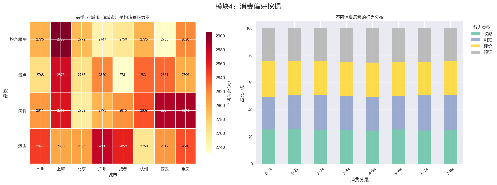
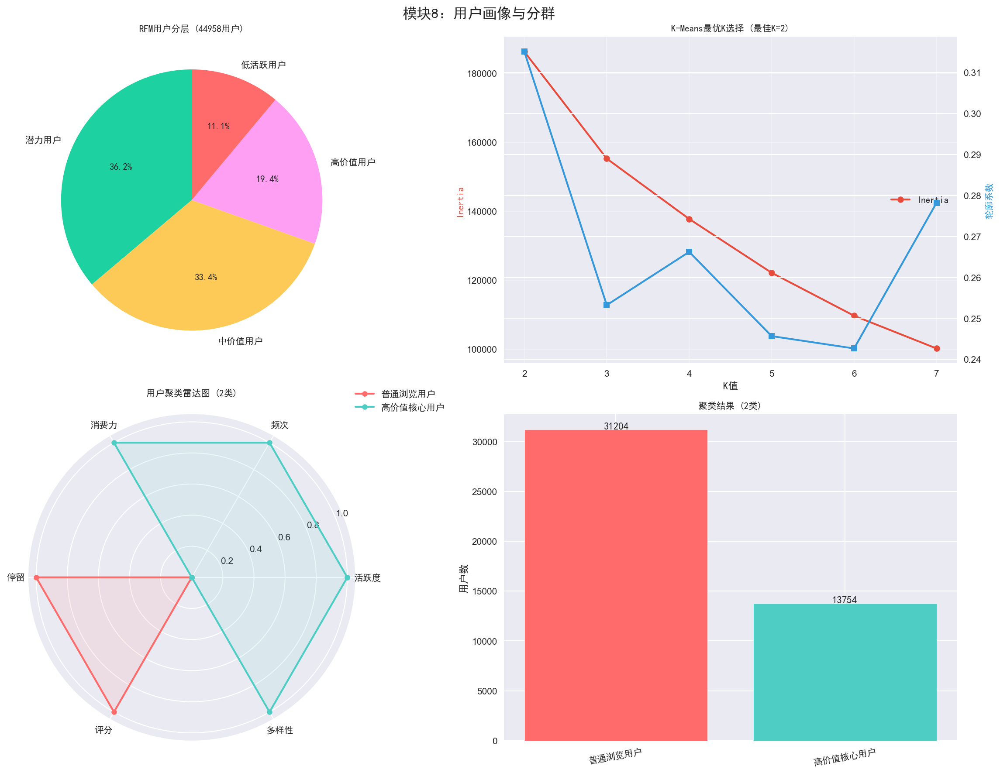
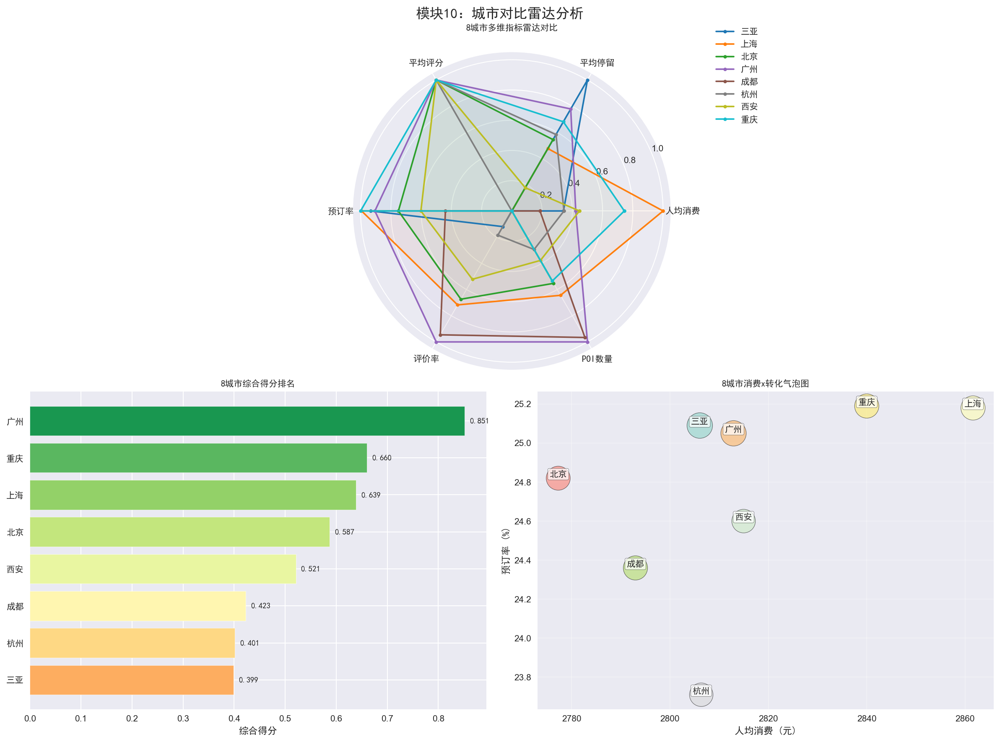

# 旅游用户行为分析与消费预测系统

对 62,200 条高德地图旅游用户行为数据进行全链路分析，建立 14 个预测模型，实现客流预测 R²=0.750、消费预测 F1=0.891。

## 数据概况

- 数据量：62,200 条用户行为记录
- 覆盖：8 个城市、4 个品类（美食/酒店/景点/旅游服务）
- 时间跨度：7 天
- 行为类型：浏览/收藏/预订/评价

## 分析模块

1. 数据清洗（缺失值/异常值/去重/日期解析）
2. 数据探索（EDA）
3. 行为路径分析
4. 消费偏好挖掘
5. 推荐策略优化（四维加权评分）
6. 时空特征分析
7. 转化漏斗分析
8. 用户画像与分群（RFM + K-Means）
9. 关联规则挖掘（Apriori）
10. 城市对比雷达分析

## 关键结论

- 高价值用户占 21.4%，贡献大部分消费
- 用户画像特征为最关键消费因子（移除后 R² 从 0.75 降至 0.16）
- 预订转化率 24.8%
- 核心用户消费水平是普通用户的 2.3 倍

## 运行方式

```bash
pip install pandas numpy scikit-learn matplotlib seaborn mlxtend python-docx
python main.py
```

`main.py` 一键运行：数据清洗 → 8 个分析模块 → 8 张图表 → 完整 Word 实验报告。

## 可视化样例




